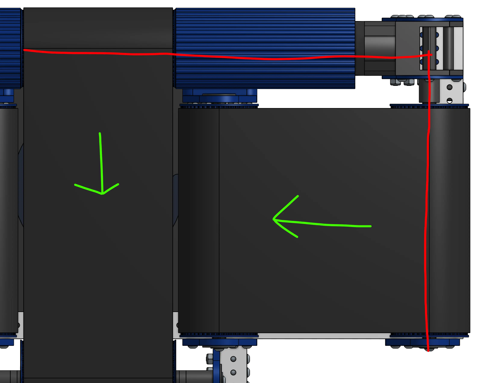
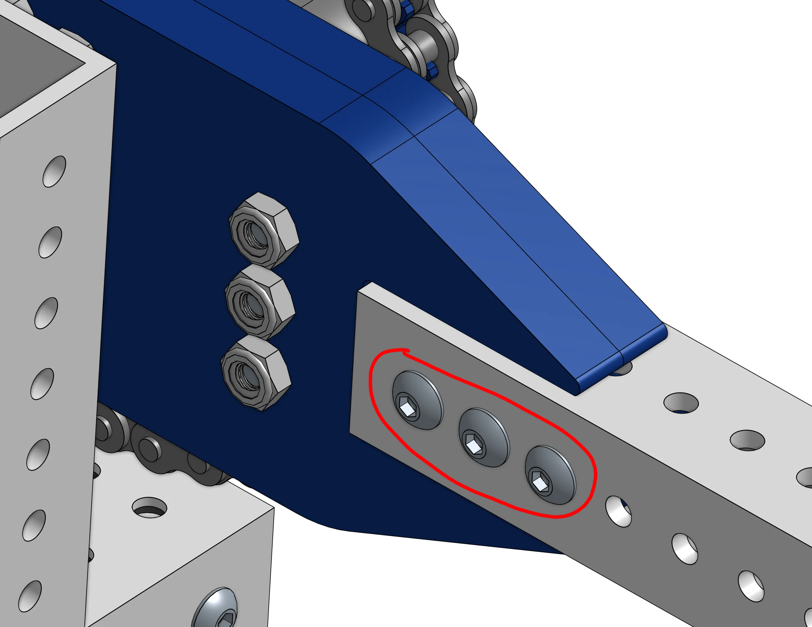

# Washed's Beavertail Intake

<figure markdown="span">
[{height=65% width=65%}](https://cad.onshape.com/documents/a8bcc47e45d88a8d0a06a0c1/w/e7681756deb1852096cca3fb/e/a6c984890b1390dde1e33ab4){target = "_blank"}
<figcaption>A slapdown from a different era of FRC commonly known as a "Beaver Tail" intake. It incorporates sideways belts to center a gamepiece through a gap in the bumpers</figcaption>
</figure>

## Behind the design

### Simplicity
This intake features a classic "Beavertail" design that was popularized in 2012, and has stuck around as a niche way to intake small-medium sized balls through a bumper cutout without sacrificing on acquisition zone.

<figure markdown="span">
{height=60% width=60%}
<figcaption>This intake utilizes the spinning section of a NEO Vortex, and MAX90 Gearbox to achieve really simple packaging</figcaption>
</figure>

### Serviceability
Even though this intake is built like a tank, anything extending outside of your robots's frame perimeter needs to be designed for serviceability. The Washed Beavertail Intake achieves this by using an intermediary plate between the 1x1 tubing arms and the pivot sprocket. If you build a second identical intake you can quickly swap them even with the tightest match schedule.

<figure markdown="span">
{height=60% width=60%}
<figcaption>By having a middleplate the entire intake can be taken off with 6 easy to access bolts.</figcaption>
</figure>

### Robustness
This intake uses a 7/8" Aluminum Tube with a bushing to achieve smooth strong movement on the pivot. 7/8" Bushings are great because the common offerings have a 1.125" OD making them compatible with most COTS sprockets. The 7/8" tube extends into the frame tube to take load off the Tube-Nut at the end of the tube.

<figure markdown="span">
{height=60% width=60%}
</figure>