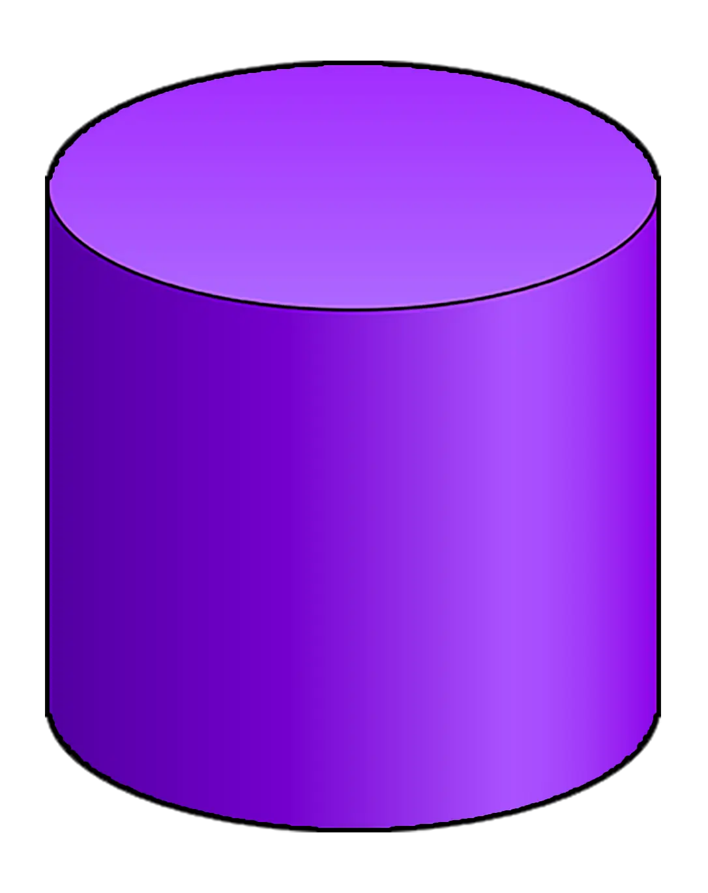

# 0D: Theory

[< 0C: Navigating Onshape](0C-navigation.md) [Stage 1A >](../stage1/1A-onshapeFundamentals.md)
 

As you probably know, CAD is a tool used to design parts digitally before they are manufactured. Most of our documentation will focus on FRC-specific CAD practice. However, to get started with Onshape, it’s important to understand some basic theory.

{align=right width=15%}

Consider a basic 3D object, such as this cylinder. Every object you design in Onshape starts with a 2D sketch within a window called a part studio. Sketches are used to define a 2D profile, that is then manipulated with features. These features transform the 2D sketch, one change at a time, into a 3D object - by “extruding” or pulling the profile into 3D, revolving it around an axis, or by other methods. 

 
## Starting with a Sketch

If you wanted to create this cylinder in Onshape, we would start by representing its profile in a 2D sketch. So what would this sketch look like for a cylinder? If we take the section from the plane on the top of the cylinder. In Onshape this is called the “Top” plane. We can see that this sketch forms a circle. 

!!! Note
    We could represent the cylinder in other 2D ways, if we chose a different plane.

## Making the leap to 3D
{align=right width=40%} {align=right width=40%}

While in the sketch, we define the nature of the circle - its position in space and its diameter. When we bring the sketch into 3D, these characteristics are maintained - determining the final diameter and position of the cylinder within the part studio. It is important to completely define the characteristics sketches so that the characteristics of the part being designed are not arbitrary. 

 
But how do we transform this defined sketch into a 3D object? By using *features*. In this case, an “extrude” feature is used to extend the profile of the sketch into 3D space.
Just like how we defined the sketch, we define the characteristics of this extrude. For example, we must specify a “depth” or final “height” for the cylinder. This is used to create the final geometry. There are many such settings we must specify when using features.

Additional sketches and features are used to add more complex geometry to parts or to create additional parts within the part studio.

!!! Note
    Features can also be used to modify existing geometry e.g. to round or chamfer corners; these don't require sketches.

## Summary

Congratulations on completing Stage 0D! 

Here is a quick summary of the theory behind creating a part in feature-based CAD:

- Create a new sketch within a new part studio
- Define the sketch with constraints
- Transform the sketch into a 3D object with specified features
- Manipulate the part with additional features 
- Repeat these steps until the part is complete

Remember: One “part studio” can have multiple, even many different parts. We won’t focus on it for now, but keep it in mind!

Stage 0 has introduced the idea of CAD and why we use it in FRC, helped you set up an Onshape account, introduced the interface of Onshape, and introduced the fundamental theory of feature-based CAD. Now it's time to move on to Stage 1 where you'll start learning the software and doing exercises, practicing skills relevant to an FRC context. Good luck!

 

0D: Theory
 
[< 0C: Navigating Onshape](0C-navigation.md) [Stage 1A >](../stage1/1A-onshapeFundamentals.md)
 
 
