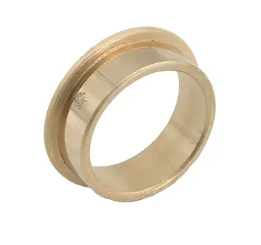

# 2C: Dead Axle Pivot

## What is a Rotary Mechanism? 
A rotary mechanism allows us to pivot objects or mechanisms through rotational movement, typically using wrists or arms.

**Types of Axles:**

| **Axle Type** | **Description**  | **Pros**   | **Cons**  |
|---------------|------------------------------------------------------------|--------------------------|-----------------------------------|
| **Dead Axle** | The axle remains stationary, and the mechanism pivots around it.   | Stronger, larger axle, no risk of axle twisting.| Requires a separate method to transfer power. May have packaging issues  |
| **Live Axle** | The axle rotates with the mechanism. Commonly used with hex axles and hubs. Not recommended due to the risk of twisting.| Simple setup; direct power transfer.  | High risk of twisting; commonly weaker due to small diameter. |
| **Coaxial Axle** | The axle rotates for one mechanism, while something separate pivots around it| Can be extremely light and compact| Difficult to design, sensitive to friction| 

### Dead Axle Benefits
- **Strength:** Larger diameter axles are stronger, resist bending, and provide consistent motion.
- **Friction Reduction:** Achieved using bushings or bearings.
- **Power Transmission:** Power is transferred through attached sprockets, pulleys, or gears, rather than through the axle itself.
- **Tensioning:** Required to handle chain stretch and reduce backlash, ensuring accuracy.

 

## Key Concepts

### Strength
The primary consideration is securely holding the rotary mechanism. Dead axles provide superior strength due to their larger diameter and resistance to twisting.

| **Material**            | **Common Diameters** | **Usage**                          |
|-------------------------|----------------------|------------------------------------|
| **6061 Round Aluminum**  | 3/4 inch, 7/8 inch   | Maximum strength-to-weight ratio.  |
| **Steel Hex Shaft**      | Varies               | Common but prone to twisting.      |

### Friction
Friction must be minimized since the mechanism pivots around the axle. This can be done using:

| **Type**       | **Advantages**   | **Usage** |
|----------------|-------------------------------------------------------------------------------------------------------------------------|----------------------------------------------------------------------------------------------|
| **Bushings**   | Strong, compact, and suitable for most applications.      | Ideal for small to medium pivots.  |
| **Bearings**   | Handle higher loads, suitable for large diameter pivots.  | Best for pivots greater than 1 inch in diameter.  |

### Power Transmission
Since the axle is stationary, power is transferred through attached components like sprockets or pulleys.

| **Component**  | **Function**    | **Notes**   |
|----------------|-------------------------------------|----------------------------------------------------------------------------------------------|
| **Sprockets**  | Common for pivoting mechanisms; requires proper bolt circle and spacing.    | 25H chain sprockets are frequently used.    |
| **Pulleys**    | Another option for transferring power to the pivot.   | Requires precise alignment to prevent chain rub.        |

### Tensioning
To accommodate chain stretch and reduce backlash, an active tensioning system is required.

| **Tensioner Type**     | **Description**                                                                                                 | **Considerations**                                                                            |
|------------------------|-----------------------------------------------------------------------------------------------------------------|----------------------------------------------------------------------------------------------|
| **Inline Tensioners**   | Adjust chain length in-line with the chain.                                                                     | Ensure enough chain length for tensioning; prevent contact with sprockets.                   |
| **Turnbuckle Tensioner**| Allows fine adjustment of chain tension.                                                                        | Add 10% extra chain length for flexibility.                                                  |
| **Spartan Tensioner**   | Compact, strong tensioner ideal for compact spaces.                                                             | Calculate travel distance using the provided formula.                                        |

### Other Sources of Backlash
| **Source**        | **Details**  | **Solution**  |
|-------------------|---------------------------------------------------------------|-----------------------------------------------------------------------------------------------|
| **Hex Interfaces**| Gaps in hex to hex hole interfaces create backlash. | Use shim tape to reduce gaps.  |
| **Sprocket Clocking** | Ensure correct alignment of sprockets to prevent uneven movement.   | Align notches on both sides. |
| **Mounting Slop** | Loose bolt-to-hole interfaces can introduce slop.  | Use proper bolting and strong spacers. |
| **Reduction Stages**| More stages increase backlash. | Keep stages to 3 or fewer for optimal performance.|

 

## Applications

### Wrist
- **Description:** Short, light rotary mechanisms. These are commonly seen to allow for ground pickup or pitch adjustments.
- **Axle Type:** You'll find coaxial, live, and dead axles for wrists. 
- **Friction Management:** Both bearings and bushings are common. 

### Large Pivots
- **Description:** Include pink arms, pivoting elevators, and large arms.
- **Axle Type:** Dead axle is preferred; consider using 35 chain for heavy loads.
- **Friction Management:** Bushings are more common, though thin x contact bearings are used occasionally.

### High Load Short Pivot
- **Description:** Pivots full mechanisms such as a shooter to adjust shot angle.
- **Axle Type:** Dead axle recommended with bearings or bushings.
- **Power Transmission:** Rack and pinion are gaining popularity.

 

## Design Rules
1. Keep the pivoting "arm" as short as possible.
2. Ensure the axle is fully supported, using either tube or nested plate.
3. Maintain a rigid support structure.
4. If the structure is wide, power both sides for additional rigidity.

 

## Project: Dead Axle Design

**Objective:** Design a simple dead axle for an elevator mechanism.

### Requirements
- **Reduction:** Use Max planetaries.
- **Chain:** Utilize 25 chain with a large sprocket reduction.
- **Axle:** Use 7/8 inch tube for the dead axle and ensure proper support.

### Process
1. Lay out the pivot location and driving sprocket position.
2. Design the support plates.
3. Complete the pivot mechanism.
4. Finalize and review the design.

Good luck!
